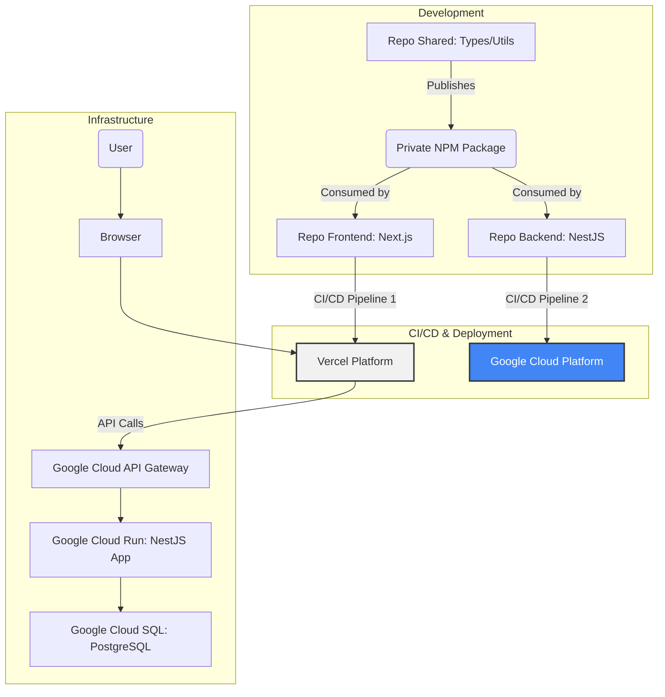

# Fullstack Architecture Document: Pomeranian Puppies Sale

## 1. Giới thiệu

Tài liệu này phác thảo kiến trúc kỹ thuật đầy đủ cho dự án **Pomeranian Puppies Sale**, bao gồm cả hệ thống backend, ứng dụng frontend và cách chúng tương tác với nhau. Nó sẽ là nguồn tham chiếu kỹ thuật chính cho đội ngũ phát triển, đảm bảo sự nhất quán trên toàn bộ ngăn xếp công nghệ (tech stack).

### Template Khởi đầu hoặc Dự án Hiện có

- **Loại dự án:** Greenfield (Dự án mới).
- **Khung sườn (Frameworks):** Dựa trên PRD, chúng ta đã quyết định sử dụng **Next.js** cho frontend và **NestJS** cho backend.
- [cite_start]**Cấu trúc Repository:** Polyrepo (hai repositories riêng biệt) để các nhóm frontend và backend có thể hoạt động độc lập. [cite: 2, 2, 2]

### Nhật ký Thay đổi (Change Log)

| Ngày       | Phiên bản | Mô tả                           | Tác giả |
| :--------- | :-------- | :------------------------------ | :------ |
| 21-06-2025 | 1.0       | Tạo tài liệu kiến trúc ban đầu. | Winston |

## 2. Kiến trúc Cấp cao

### Tóm tắt Kỹ thuật (Technical Summary)

Hệ thống sẽ được xây dựng theo kiến trúc polyrepo với hai kho mã nguồn riêng biệt: một cho ứng dụng frontend **Next.js** và một cho API backend **NestJS**. Frontend sẽ được triển khai trên **Vercel** dưới dạng một ứng dụng web tĩnh và render phía máy chủ (SSR) để tối ưu hiệu suất và SEO. Backend sẽ được triển khai trên **Google Cloud Run** dưới dạng các API không máy chủ (serverless) để đảm bảo khả năng mở rộng và tối ưu chi phí. Hai hệ thống sẽ giao tiếp với nhau qua các API RESTful. Một package private chung sẽ được sử dụng để đồng bộ hóa các định nghĩa kiểu dữ liệu và các hàm tiện ích giữa hai repo.

### Nền tảng và Hạ tầng (Platform and Infrastructure Choice)

- **Frontend (Next.js):** Triển khai trên **Vercel**.
- **Backend (NestJS):** Triển khai trên **Google Cloud Run**.
- **Cơ sở dữ liệu:** **Google Cloud SQL for PostgreSQL**.

### Cấu trúc Repository (Repository Structure)

- **Mô hình:** Polyrepo.
- **Repo 1:** `pomeranian-puppies-frontend` (chứa ứng dụng Next.js).
- **Repo 2:** `pomeranian-puppies-backend` (chứa API NestJS).
- **Repo 3 (Khuyến nghị):** `pomeranian-puppies-shared` (chứa package dùng chung, được publish dưới dạng private NPM package).

### Sơ đồ Kiến trúc Cấp cao

### Các Mẫu Kiến trúc và Thiết kế (Architectural and Design Patterns)

- **API Gateway:** Sử dụng Google Cloud API Gateway làm cổng vào duy nhất cho tất cả các yêu cầu đến backend.
- [cite\_start]**Repository Pattern:** Áp dụng trong NestJS backend để tách biệt logic nghiệp vụ khỏi logic truy vấn cơ sở dữ liệu. [cite: 1980]
- [cite\_start]**Component-Based UI:** Tận dụng tối đa kiến trúc component của Next.js (React) để xây dựng một giao diện có khả năng tái sử dụng cao. [cite: 1980]
- **Server-Side Rendering (SSR) & Static Site Generation (SSG):** Sử dụng các khả năng của Next.js để render trước các trang, cải thiện hiệu suất và SEO.

## 3\. Ngăn xếp Công nghệ (Tech Stack)

| Hạng mục                       | Công nghệ                           | Phiên bản    | Mục đích & Lý do                                                                                                       |
| :----------------------------- | :---------------------------------- | :----------- | :--------------------------------------------------------------------------------------------------------------------- |
| **Ngôn ngữ Chung**             | **TypeScript**                      | \~5.4        | Ngôn ngữ chính cho cả frontend và backend để đảm bảo an toàn kiểu và đồng bộ.                                          |
| **Runtime**                    | **Node.js**                         | \~20.x (LTS) | Môi trường thực thi JavaScript phía máy chủ.                                                                           |
| **Frontend Framework**         | **Next.js**                         | \~14.x       | Framework React cho frontend, tối ưu cho SEO, hiệu suất và tích hợp với Vercel.                                        |
| **Backend Framework**          | **NestJS**                          | \~10.x       | Framework Node.js cho backend, cung cấp kiến trúc module, có khả năng mở rộng.                                         |
| **UI Component Library**       | **Shadcn/ui** + **Tailwind CSS**    | Mới nhất     | Cung cấp các thành phần UI headless, dễ tùy chỉnh.                                                                     |
| **Quản lý Trạng thái FE**      | **Redux Toolkit**                   | \~2.x        | **(Lựa chọn của bạn)** Giải pháp mạnh mẽ và có cấu trúc để quản lý trạng thái phức tạp.                                |
| **Kiểu API**                   | **RESTful API**                     | N/A          | Kiến trúc API tiêu chuẩn.                                                                                              |
| **Cơ sở dữ liệu**              | **Google Cloud SQL (PostgreSQL)**   | \~16.x       | **(Thay đổi theo GCP)** Hệ CSDL quan hệ được quản lý trên GCP.                                                         |
| **Xác thực**                   | **JWT (Tự quản lý)**                | N/A          | **(Lựa chọn của bạn)** Tự triển khai logic xác thực trong NestJS. **Lưu ý bảo mật:** Đòi hỏi phải triển khai cẩn thận. |
| **Kiểm thử (Testing)**         | **Jest** & **Playwright**           | Mới nhất     | Jest cho Unit/Integration Test, Playwright cho End-to-End Test.                                                        |
| **Công cụ CI/CD**              | **GitHub Actions**                  | N/A          | Tự động hóa quy trình kiểm thử, build và triển khai.                                                                   |
| **Hạ tầng dưới dạng mã (IaC)** | **Terraform**                       | \~1.8.x      | **(Thay đổi theo GCP)** Công cụ IaC đa nền tảng để quản lý tài nguyên GCP.                                             |
| **Giám sát & Ghi log**         | **Google Cloud's operations suite** | N/A          | **(Thay đổi theo GCP)** Giải pháp gốc của GCP để thu thập log và giám sát.                                             |

## 4\. Mô hình Dữ liệu (Data Models)

_Định nghĩa chi tiết cho các interface User, UserProfile, Pet, PetTimelineEvent, Product, Category, Order, OrderItem, BlogPost, BlogComment, Question, Answer, PhotoContest, ContestEntry, Favorite, và Notification được đặt ở đây._

## 5\. Đặc tả API (REST API Spec)

_Định nghĩa cấu trúc OpenAPI 3.0 với các endpoint ví dụ cho /auth/register, /pets/for-sale, và /users/me/favorites được đặt ở đây._

## 6\. Các Thành phần (Components)

_Định nghĩa trách nhiệm cho Frontend App, Backend API (chia theo service), Gói Dùng chung, và sơ đồ tương tác._

## 7\. Các API Bên ngoài (External APIs)

_Định nghĩa các dịch vụ cần tích hợp: Google/Facebook/Apple Login, Cổng thanh toán (VNPay/Momo/Stripe), và Private NPM Registry._

## 8\. Luồng hoạt động Cốt lõi (Core Workflows)

_Sơ đồ trình tự cho "Đăng ký Người dùng qua Mạng xã hội" và "Quy trình Đặt chỗ và Thanh toán cho Thú cưng"._

## 9\. Lược đồ Cơ sở dữ liệu (Database Schema)

_Mã SQL DDL để tạo các bảng users, user_profiles, pets, products, orders và các chỉ mục liên quan trong PostgreSQL._

## 10\. Kiến trúc Frontend

_Định nghĩa kiến trúc Component, quản lý trạng thái với Redux Toolkit, và lớp dịch vụ._

## 11\. Kiến trúc Backend

_Định nghĩa kiến trúc Module trong NestJS và đề xuất sử dụng Prisma ORM._

## 12\. Cấu trúc Thư mục Dự án (Unified Project Structure)

_Sơ đồ cấu trúc thư mục cho hai repository `pomeranian-puppies-frontend` và `pomeranian-puppies-backend`._

## 13\. Kiến trúc Triển khai (Deployment Architecture)

_Định nghĩa chiến lược triển khai cho Vercel, Google Cloud Run, và ví dụ CI/CD pipeline với GitHub Actions._

## 14\. Bảo mật và Hiệu suất

_Liệt kê các yêu cầu về bảo mật và các chiến lược tối ưu hiệu suất cho cả frontend và backend._

## 15\. Chiến lược Kiểm thử

_Mô tả kim tự tháp kiểm thử và cách tổ chức các loại test._

## 16\. Tiêu chuẩn Viết mã (Coding Standards)

_Các quy tắc cốt lõi về an toàn kiểu dữ liệu, biến môi trường và tính nhất quán của API._
